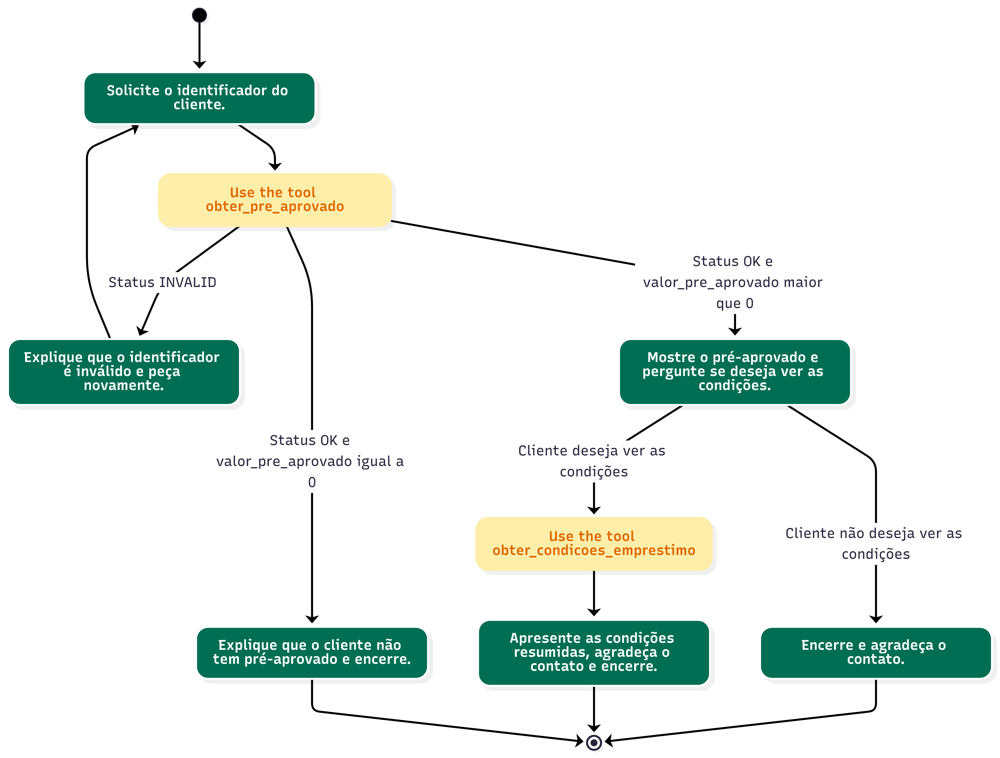
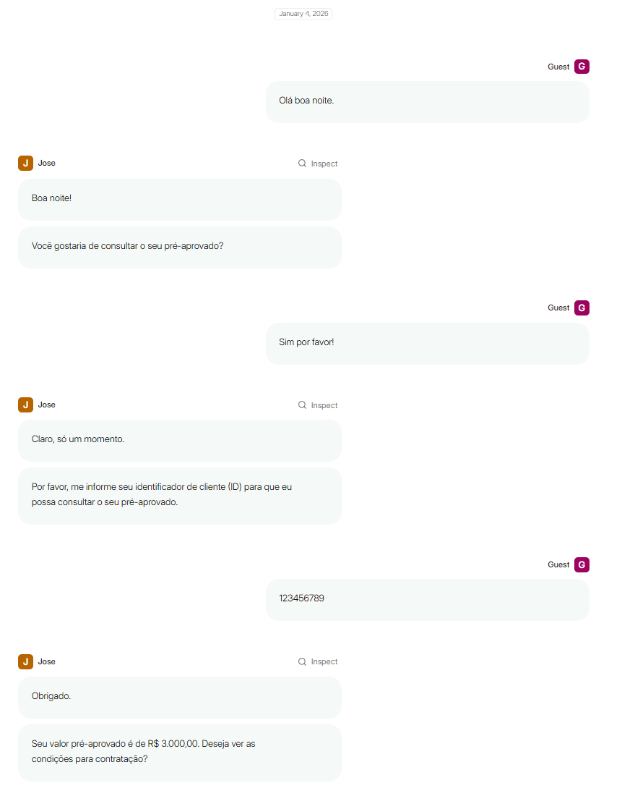
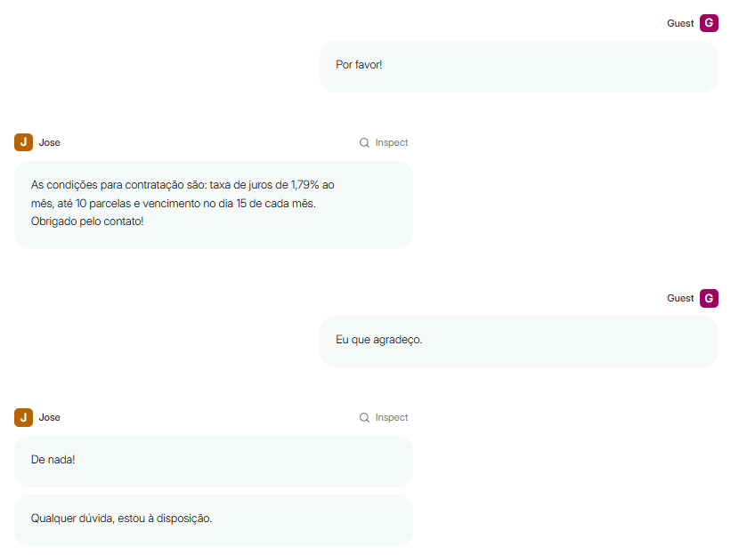
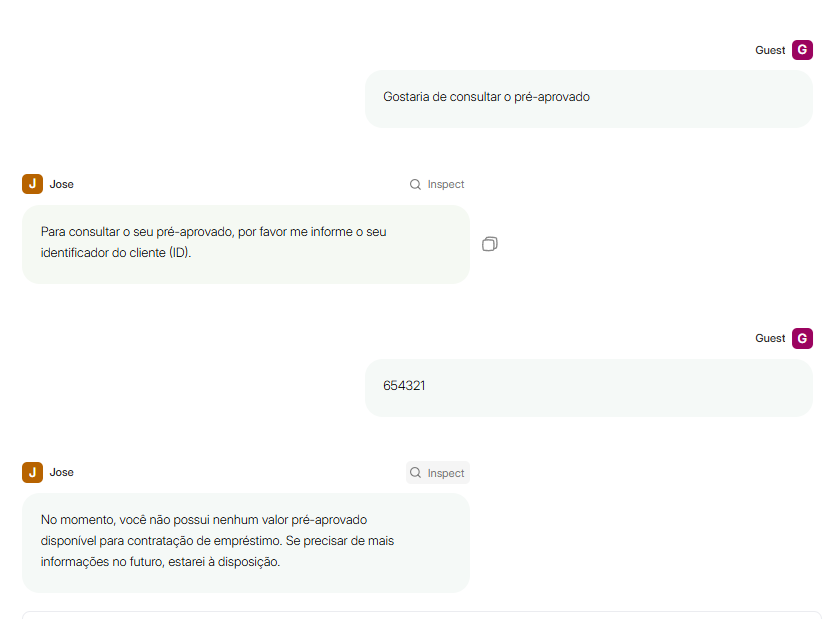
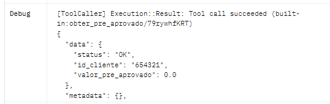
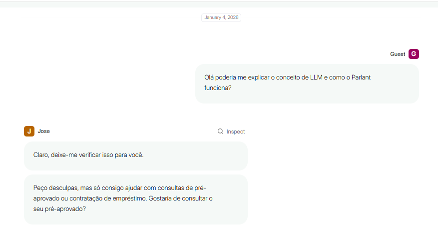

# Parlant: POC de Alignment Engine para criação de agentes

POC demonstrando como o framework **[Parlant](https://www.parlant.io/)** facilita a criação de AI Agents através do conceito de *Alignment Engine*. A proposta é mostrar, com pouco código e quase nenhum prompt, como controlar as interações do agente com o usuário final usando **Guidelines**, **Tools**, **Journeys** e **Glossary** — tudo definido em código. Também é possível restringir totalmente as respostas com **Canned Responses**.

## Principais benefícios observados

- **Controle total do comportamento**: o prompt é gerado automaticamente respeitando as regras e ferramentas definidas em código.
- **Rápida criação de jornadas**: foi possível montar o fluxo de consulta de pré-aprovado em poucos passos, sem ajustar prompts manualmente.
- **Robustez fora do caminho feliz**: mesmo quando o usuário pede algo fora do escopo, o agente se mantém alinhado às regras.
- **Respostas aprovadas previamente**: com *Canned Responses* o agente retorna apenas textos validados.

## Resultados do POC

### Jornada Criada

### Consulta de pré-aprovado (caminho feliz)

O agente guia o usuário pela jornada prevista, solicitando apenas as informações necessárias e respondendo dentro das regras configuradas.

### Solicitações fora do escopo

Mesmo quando o usuário tenta obter algo que não foi previsto, o agente mantém o alinhamento com as regras definidas.

### Jornada alternativa

Outro fluxo mais completo também se manteve consistente com as diretrizes configuradas.

## Referências

- Parlant: https://www.parlant.io
- Exemplo de uso rápido: https://www.parlant.io/docs/quickstart/examples

